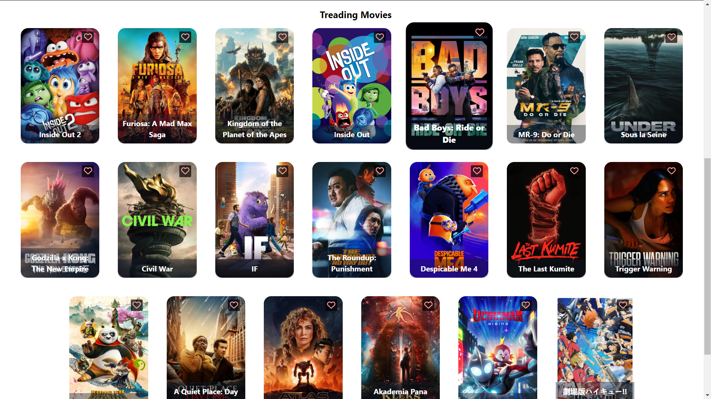
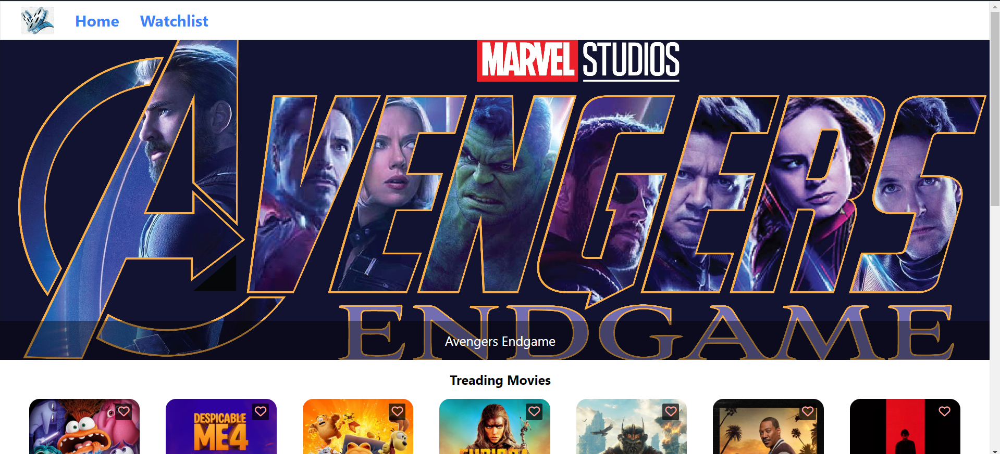

# IMDB-CLONE

this is a very simple IMDB-Clone application written using React.js

the `node_modules` have not been uploaded.


download the Zip file then open extracted forlder in vs code.
Then in cmd type `npm install` so, all packages will install.

<h3>How to run it</h3> 
copy the following and paste in that folder's cmd

```
  npm run dev   
```

<h3>Results</h3>


